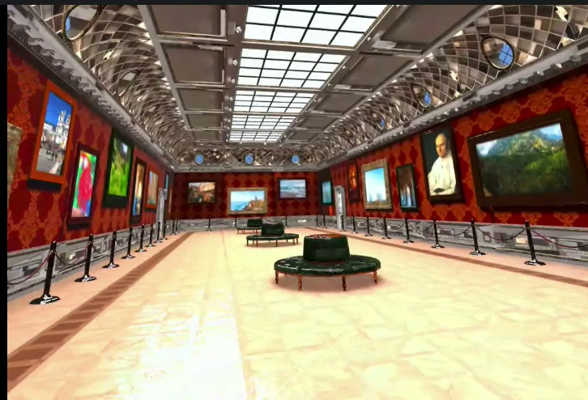
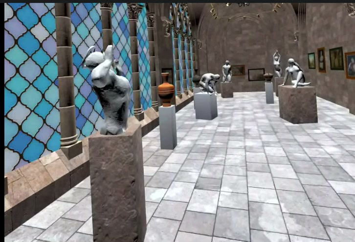
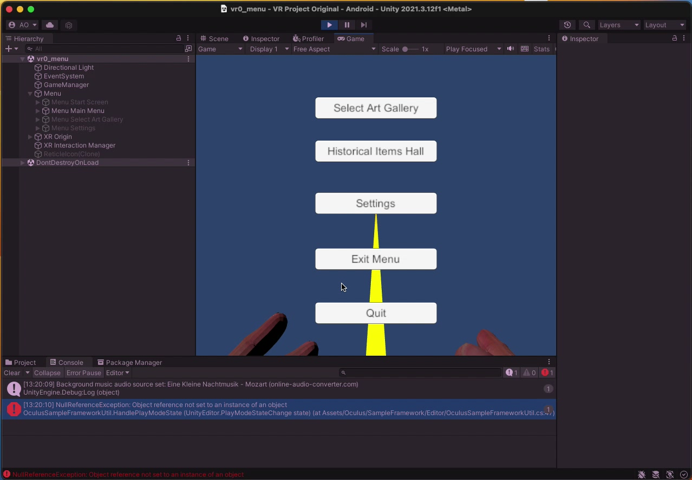

# vr-museum
Using models from Unity asset store and dynamically loading arts from different museums to view them inside of your VR Headset. In this project I've implemented walk-in-place (VR locomotion) widget for Meta Quest 2 and also arm-swing-movement, following a predefined path.

## Screenshots

The screenshots show development scenes captured from the VR Museum project recordings.

### Art gallery

Paintings displayed throughout the virtual gallery. Captured from `vid3.mov` at approximately 00:46.

### Sculpture gallery

Sculptures, vases, and paintings arranged in a shared exhibition space. Captured from `vid2.mov` at approximately 00:04.

### VR menu

Unity editor view showing gallery selection, settings, and the VR controller pointer. Captured from `vid1.mov` at approximately 01:14.
